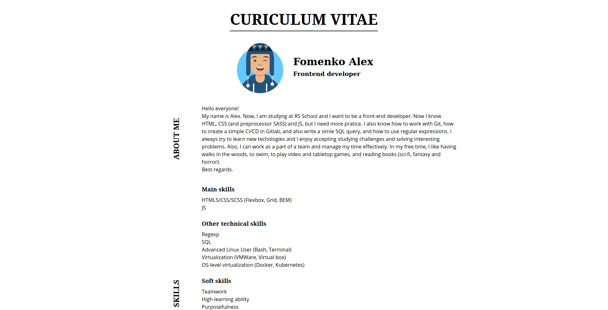

# RS SCHOOL REPOSITORIES  

## HTML, CSS & Git
[CV](https://mrstatic23.github.io/rsschool-cv/cv)

## HTML, CSS
1. Task: https://rolling-scopes-school.github.io/stage0/#/stage0/tasks/html-css
2. Screenshot:

3. Deploy: [Link](https://mrstatic23.github.io/rsschool-cv/cv)
4. Done: 08.03.2021 / deadline 08.03.2021
5. Score: 100/100
- [x] вёрстка валидная +10 ([Link](https://validator.w3.org/nu/?doc=https%3A%2F%2Fmrstatic23.github.io%2Frsschool-cv%2F))
- [x] вёрстка семантическая +10 (использованы: header, main, footer, section, time)
- [x] используются заголовки h1-h6 +10 (использованы: h1, h2, h3, h4)
- [x] для оформления СV используются css-стили +10
- [x] контент размещается в блоке, который горизонтально центрируется на странице +10
- [x] на странице СV присутствует изображение, пропорции изображения не искажены, у изображения есть атрибут alt +10
- [x] контакты для связи и перечень навыков оформлены в виде списка ul > li +10
- [x] CV содержит контакты для связи, краткую информацию о себе, перечень навыков, примеры кода или выполненных проектов, информацию об образовании и уровне английского +10
- [x] CV выполнено на английском языке +10
- [x] выполнены требования к репозиторию: есть ссылка на задание, скриншот страницы СV, ссылка на деплой страницы CV на GitHub Pages, выполнена самооценка +10